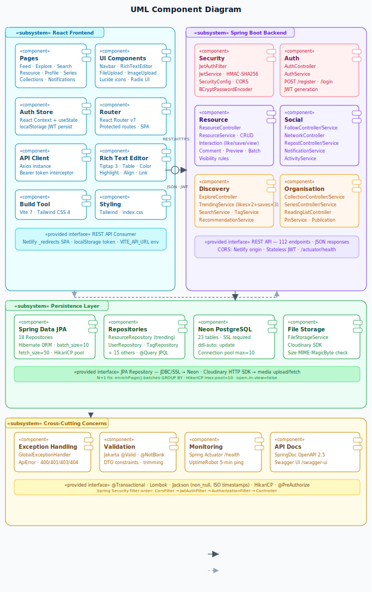
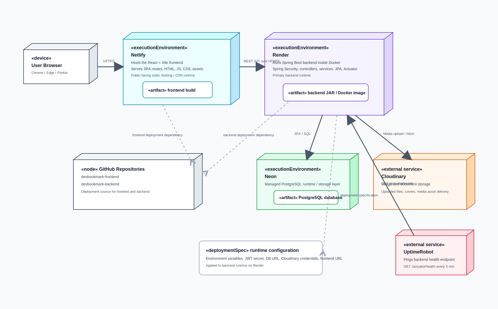
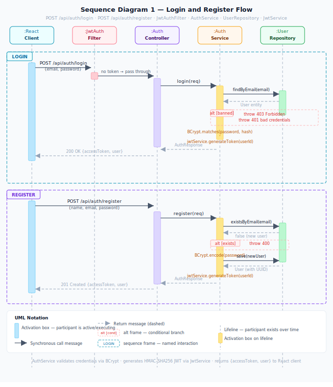

# DevBookmark — Backend


A production-ready REST API for a full-stack social platform where developers save, share, and discover programming resources.

🔗 **Live Demo:** https://devbookmark.netlify.app  
📦 **Frontend Repo:** https://github.com/Siddhi-1711/devbookmark-frontend

---

## Tech Stack

| Layer | Technology |
|---|---|
| Language | Java 21 |
| Framework | Spring Boot 3.5 |
| Database | PostgreSQL (Neon — serverless) |
| ORM | Spring Data JPA / Hibernate |
| Auth | Stateless JWT (HMAC-SHA256) |
| File Storage | Cloudinary |
| Deployment | Render (Docker) |
| Frontend | React 19 · Vite 7 · Tailwind CSS 4 |
| Frontend Host | Netlify |

---

## Project Stats

| Metric | Value |
|---|---|
| Java source files | 146 |
| Packages (vertical slices) | 24 |
| REST endpoints | 112 |
| Database tables | 23 |
| Feed query reduction | 101 → 7 (93%) |
| Max file upload size | 10 MB |
| JWT expiry | 24 hours |
| Trending window | 1–30 days (configurable) |

---

## Architecture Diagrams

### 1. High-Level System Architecture


> React frontend calls the Spring Boot REST API secured by JWT and Spring Security. Services use JPA repositories with PostgreSQL, while uploaded media is stored in Cloudinary.

---

### 2. UML Component Diagram



> Shows all components across 4 subsystems — React Frontend, Spring Boot Backend, Persistence Layer, and Cross-Cutting Concerns — with provided/required interfaces and dependency arrows.

---

### 3. Authentication Flow


> Every authenticated request passes through a 4-step pipeline: JWT validation → ban enforcement → RBAC → content visibility rules. Invalid tokens return 401, banned users return 403.

---

### 4. UML Deployment Diagram



> Shows nodes, execution environments, artifacts, and communication paths across Netlify, Render (Docker), Neon PostgreSQL, Cloudinary, GitHub CI/CD, and UptimeRobot.

---

### 5. Database ER Diagram

> Full interactive ER diagram with all 23 tables, crow's foot notation, and all fields from actual JPA entity classes.  
> 📄 **[View ER Diagram (HTML)](./diagrams/er_diagram.html)**

| Table | Relationships |
|---|---|
| `users` | owns resources, likes, saves, comments, series, collections, reposts, notifications, reading_list, publications |
| `resources` | receives likes, saves, comments, views, tags, series_items, collection_resources, reposts, notifications |
| `resource_comments` | self-referencing parent → replies |
| `tags` | used in resource_tags, followed via tag_follows |
| `series` → `series_items` → `resources` | ordered multi-part series |
| `collections` → `collection_resources` → `resources` | user-curated collections |
| `user_follows` | self-referencing follower/followee on users |
| `notifications` | recipient + actor both FK to users, optional resource FK |
| `publications` | one-to-one with users |

```
users ──────────────── resources ──────── resource_likes
  │    (owns)              │    (receives) resource_saves
  │                        │              resource_comments (self-ref replies)
  ├── user_follows          │              resource_views
  ├── tag_follows           │              resource_tags ── tags ── tag_follows
  ├── series                │              series_items
  ├── collections           │              collection_resources
  ├── reposts               │              reposts
  ├── notifications         │              reading_list
  └── reading_list          └── notifications
```

---

### 6. Sequence Diagram — Login & Register



> Full call flow from React client through JwtAuthFilter → AuthController → AuthService → UserRepository → JwtService. Covers BCrypt password verification, `existsByEmail` idempotency check, and error branches (401/400/403).

---

### 7. Sequence Diagram — Feed Load (N+1 Fix)


> Shows how FeedService fetches `followingIds`, `followedTags`, calls `findFeedWithTags()`, then `enrichPage()` — batching all like/save/repost counts in GROUP BY queries. Result: **7 queries total** regardless of page size, down from 101+.

---

### 8. Sequence Diagram — Like Resource + Notification


> Covers the full `POST /api/resources/{id}/like` flow: idempotency check → `@Transactional` save → `ActivityService.logActivityLike` → `NotificationService.notifyLike` with self-notification guard.

---

## Security Pipeline

Every authenticated request passes through a 4-layer filter chain:

```
Incoming Request
      │
      ▼
┌─────────────────────────────────┐
│  1. JWT Validation              │
│     Extract Bearer token        │
│     Verify HMAC-SHA256 signature│
│     Check expiry                │
│     Load UserDetails            │
└──────────────┬──────────────────┘
               │ valid token
               ▼
┌─────────────────────────────────┐
│  2. Ban Enforcement             │
│     Check user.banned flag      │
│     Reject if banned → 403      │
└──────────────┬──────────────────┘
               │ not banned
               ▼
┌─────────────────────────────────┐
│  3. Role-Based Access Control   │
│     ROLE_USER  → standard APIs  │
│     ROLE_ADMIN → /api/admin/**  │
└──────────────┬──────────────────┘
               │ authorized
               ▼
┌─────────────────────────────────┐
│  4. Content Visibility Rules    │
│     PUBLIC    → everyone        │
│     FOLLOWERS → followers only  │
│     PRIVATE   → owner only      │
└──────────────┬──────────────────┘
               │
               ▼
          Controller
```

---

## N+1 Query Fix

```
Before (N+1):
  1 query   → fetch 100 resources
  100 queries → like count per resource
  100 queries → save count per resource
  ─────────────────────────────────────
  201+ queries total per page load

After (Batch GROUP BY):
  1 query → fetch resources
  1 query → GROUP BY like counts
  1 query → GROUP BY save counts
  1 query → GROUP BY repost counts
  1 query → liked/saved by me
  1 query → series context
  ─────────────────────────────────────
  7 queries total — regardless of page size
  93% reduction in database round-trips
```

---

## File Upload Validation Pipeline

```
Incoming File Upload
        │
        ▼
┌──────────────────────────┐
│  Layer 1: Size Check     │
│  MAX 10 MB enforced      │
└──────────┬───────────────┘
           │ pass
           ▼
┌──────────────────────────┐
│  Layer 2: MIME Allowlist │
│  PDF, DOC, DOCX, TXT,    │
│  PNG, JPG, JPEG, GIF     │
└──────────┬───────────────┘
           │ pass
           ▼
┌──────────────────────────┐
│  Layer 3: Magic Bytes    │
│  Read file header bytes  │
│  Blocks .exe renamed     │
│  as .pdf                 │
└──────────┬───────────────┘
           │ pass
           ▼
    Upload to Cloudinary
```

---

## Trending Algorithm

```
score = (likes × 2) + (saves × 3)

Ranked over configurable window (1–30 days).
Saves weighted higher — signals deeper intent.
```

---


---

## API Overview

| Domain | Endpoints | Auth |
|---|---|---|
| Auth | POST /api/auth/register, /login | No |
| Resources | GET/POST/PUT/DELETE /api/resources/** | GET: No, Write: Yes |
| Feed | GET /api/feed | Yes |
| Explore / Trending | GET /api/explore/trending | No |
| Search | GET /api/search | No |
| Collections | /api/collections/** | GET: No, Write: Yes |
| Series | /api/series/** | GET: No, Write: Yes |
| Tags | /api/tags/** | GET: No, Follow: Yes |
| Social (likes/saves) | POST/DELETE /api/resources/{id}/like,save | Yes |
| Reposts | POST/DELETE /api/reposts/{id} | Yes |
| Comments | /api/resources/{id}/comments | GET: No, Write: Yes |
| Notifications | GET /api/notifications | Yes |
| Reading List | /api/reading-list | Yes |
| Recommendations | GET /api/recommendations | Yes |
| File Upload | POST /api/files/upload | Yes |
| Admin | /api/admin/** | ROLE_ADMIN |

---

## Local Setup

**Prerequisites:** Java 21, Maven, Docker (for local PostgreSQL)

```bash
# 1. Clone the repo
git clone https://github.com/Siddhi-1711/devbookmark-backend
cd devbookmark-backend

# 2. Start local PostgreSQL via Docker Compose
docker compose up -d

# 3. Copy and fill in environment variables
cp .env.example .env

# 4. Run the app
./mvnw spring-boot:run
```

**Environment Variables (`.env`):**

```env
# Database — matches docker-compose.yml defaults
DB_URL=jdbc:postgresql://localhost:15433/devbookmark
DB_USERNAME=devbookmark
DB_PASSWORD=devbookmark

# JWT
JWT_SECRET=your_256_bit_secret_here
JWT_EXPIRATION_MINUTES=1440

# Cloudinary
CLOUDINARY_CLOUD_NAME=your_cloud_name
CLOUDINARY_API_KEY=your_api_key
CLOUDINARY_API_SECRET=your_api_secret

# CORS
FRONTEND_URL=http://localhost:5173
```

**Health check:** `http://localhost:8080/actuator/health`

---

## Deployment (Docker)

```dockerfile
FROM maven:3.9.6-eclipse-temurin-21 AS build
WORKDIR /app
COPY pom.xml .
COPY src ./src
RUN mvn clean package -DskipTests

FROM eclipse-temurin:21-jre
WORKDIR /app
COPY --from=build /app/target/*.jar app.jar
EXPOSE 8080
ENTRYPOINT ["java", "-Xmx400m", "-jar", "app.jar"]
```

Backend deployed on **Render** (free tier, kept awake via UptimeRobot).  
Database hosted on **Neon** (serverless PostgreSQL).